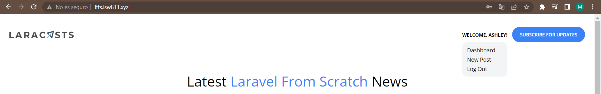
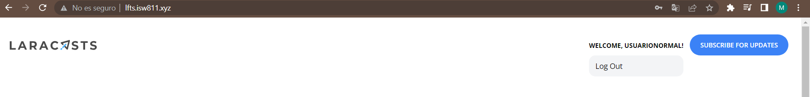

[< Volver al índice](/docs/readme.md)

# All About Authorization

Por ahora cualquiera usuario puede ver los enlaces de administrador en el menu desplegable, por tanto se va arreglar eso. 

En `app/Providers/AppServiceProvider.php` se hará la restricción de los usuarios, donde solo el administrador puede acceder crear posts con *Gate*. Y *Blade* son las etiquetas que usaremos para que solo elo administrador pueda verlas. Con esto ya necesitaremos el middleware *MustBeAdministrator*

```php
    use App\Models\User;
    use Illuminate\Support\Facades\Blade;
    use Illuminate\Support\Facades\Gate;
```
```php
    public function boot()
    {
        Model::unguard();

        Gate::define('admin', function (User $user) {
            return $user->username === 'ash01';
        });


        Blade::if('admin', function () {            
            return optional(request()->user())->can('admin');
        });
    }
```

En `resources/views/components/layout.blade.php` pondremos las etiquetas Blade que acabamos de crear haciendo que solo el administrador pueda ver los siguientes elementos en el menú desplegable. 

```html
    @admin 
        <x-dropdown-item href="/admin/posts" :active="request()->is('admin/posts')">Dashboard</x-dropdown-item>
        <x-dropdown-item href="/admin/posts/create" :active="request()->is('admin/posts/create')">New Post</x-dropdown-item>
    @endadmin
```
Podemos agrupar nuestras rutas en `routes/web.php` con el middleware, ya hacer que todas las rutas que teníamos del administrador sea un sola. 

```php
    Route::middleware('can:admin')->group(function () {
        Route::resource('admin/posts', AdminPostController::class)->except('show');
    });
```
- Administrador 
    
- Usuario corriente
   