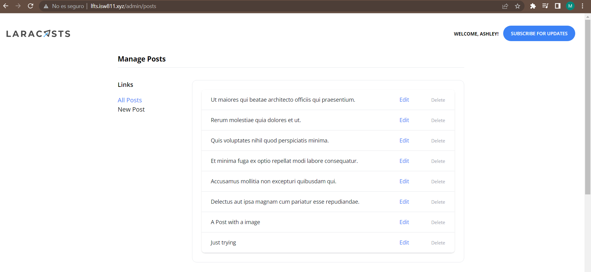

[< Volver al índice](/docs/readme.md)

# Create a Form to Edit and Delete Posts

En este episodio haremos que se pueda editar y eliminar un post. Para esto vamos a crear un controlador para las configuraciones del administrador con el siguiente comando: 

```bash 
    php artisan make:controller AdminPostController 
```

En el cual pondremos funciones para devolver las vistas, crear posts *store()*, editarlos *update()*, y eliminarlos *destroy()*

```php
class AdminPostController extends Controller
{
    public function index()
    {
        return view('admin.posts.index', [
            'posts' => Post::paginate(50)
        ]);
    }

    public function create()
    {
        return view('admin.posts.create');
    }

    public function store()
    {
        $attributes = request()->validate([
            'title' => 'required',
            'thumbnail' => 'required|image',
            'slug' => ['required', Rule::unique('posts', 'slug')],
            'excerpt' => 'required',
            'body' => 'required',
            'category_id' => ['required', Rule::exists('categories', 'id')]
        ]);

        $attributes['user_id'] = auth()->id();
        $attributes['thumbnail'] = request()->file('thumbnail')->store('thumbnails');

        Post::create($attributes);

        return redirect('/');
    }

    public function edit(Post $post)
    {
        return view('admin.posts.edit', ['post' => $post]);
    }

    public function update(Post $post)
    {
        $attributes = request()->validate([
            'title' => 'required',
            'thumbnail' => 'image',
            'slug' => ['required', Rule::unique('posts', 'slug')->ignore($post->id)],
            'excerpt' => 'required',
            'body' => 'required',
            'category_id' => ['required', Rule::exists('categories', 'id')]
        ]);

        if (isset($attributes['thumbnail'])) {
            $attributes['thumbnail'] = request()->file('thumbnail')->store('thumbnails');
        }

        $post->update($attributes);

        return back()->with('success', 'Post Updated!');
    }

    public function destroy(Post $post)
    {
        $post->delete();

        return back()->with('success', 'Post Deleted!');
    }
}

```

Vamos a crear un nuevo directorio `resources/views/admin/posts`: 

- Vamos a mover `posts/create.blade.php` a nuestro nuevo directorio, el cual es la vista que nos permite crear posts. 
- Crearemos la vista `index.blade.php` la cual se desplegarán todos los posts desde la base de datos, además, tendrá dos acciones editar y eliminar. 

    ```php
        <x-layout>
            <x-setting heading="Manage Posts">
                <div class="flex flex-col">
                    <div class="-my-2 overflow-x-auto sm:-mx-6 lg:-mx-8">
                        <div class="py-2 align-middle inline-block min-w-full sm:px-6 lg:px-8">
                            <div class="shadow overflow-hidden border-b border-gray-200 sm:rounded-lg">
                                <table class="min-w-full divide-y divide-gray-200">
                                    <tbody class="bg-white divide-y divide-gray-200">
                                        @foreach ($posts as $post)
                                            <tr>
                                                <td class="px-6 py-4 whitespace-nowrap">
                                                    <div class="flex items-center">
                                                        <div class="text-sm font-medium text-gray-900">
                                                            <a href="/posts/{{ $post->slug }}">
                                                                {{ $post->title }}
                                                            </a>
                                                        </div>
                                                    </div>
                                                </td>

                                                <td class="px-6 py-4 whitespace-nowrap text-right text-sm font-medium">
                                                    <a href="/admin/posts/{{ $post->id }}/edit" class="text-blue-500 hover:text-blue-600">Edit</a>
                                                </td>

                                                <td class="px-6 py-4 whitespace-nowrap text-right text-sm font-medium">
                                                    <form method="POST" action="/admin/posts/{{ $post->id }}">
                                                        @csrf
                                                        @method('DELETE')

                                                        <button class="text-xs text-gray-400">Delete</button>
                                                    </form>
                                                </td>
                                            </tr>
                                        @endforeach
                                    </tbody>
                                </table>
                            </div>
                        </div>
                    </div>
                </div>
            </x-setting>
        </x-layout>
    ```
- También crearemos una vista `edit.blade.php`, en la cual permitirá al usuario editar los post trayendo desde la base de datos el contenido del post, para cambiarlo. 

    ```php
        <x-layout>
            <x-setting :heading="'Edit Post: ' . $post->title">
                <form method="POST" action="/admin/posts/{{ $post->id }}" enctype="multipart/form-data">
                    @csrf
                    @method('PATCH')

                    <x-form.input name="title" :value="old('title', $post->title)" required />
                    <x-form.input name="slug" :value="old('slug', $post->slug)" required />

                    <div class="flex mt-6">
                        <div class="flex-1">
                            <x-form.input name="thumbnail" type="file" :value="old('thumbnail', $post->thumbnail)" />
                        </div>

                        thumbnail) }}" alt="" class="rounded-xl ml-6" width="100">
                    </div>

                    <x-form.textarea name="excerpt" required>{{ old('excerpt', $post->excerpt) }}</x-form.textarea>
                    <x-form.textarea name="body" required>{{ old('body', $post->body) }}</x-form.textarea>

                    <x-form.field>
                        <x-form.label name="category"/>

                        <select name="category_id" id="category_id" required>
                            @foreach (\App\Models\Category::all() as $category)
                                <option
                                    value="{{ $category->id }}"
                                    {{ old('category_id', $post->category_id) == $category->id ? 'selected' : '' }}
                                >{{ ucwords($category->name) }}</option>
                            @endforeach
                        </select>

                        <x-form.error name="category"/>
                    </x-form.field>

                    <x-form.button>Update</x-form.button>
                </form>
            </x-setting>
        </x-layout>
    ```

Por ultimo, ya que creamos un controlador, lo agregamos a nuestras rutas en `routes/web.php`, y crearemos unas nuevas para eliminar y editar el post, con el respectivo middleware del administrador. 

```php
    use App\Http\Controllers\AdminPostController;
```
```php
    Route::post('admin/posts', [AdminPostController::class, 'store'])->middleware('admin');
    Route::get('admin/posts', [AdminPostController::class, 'index'])->middleware('admin');

    Route::get('admin/posts/create', [AdminPostController::class, 'create'])->middleware('admin');

    Route::get('admin/posts/{post}/edit', [AdminPostController::class, 'edit'])->middleware('admin');
    Route::patch('admin/posts/{post}', [AdminPostController::class, 'update'])->middleware('admin');
    Route::delete('admin/posts/{post}', [AdminPostController::class, 'destroy'])->middleware('admin');
```

