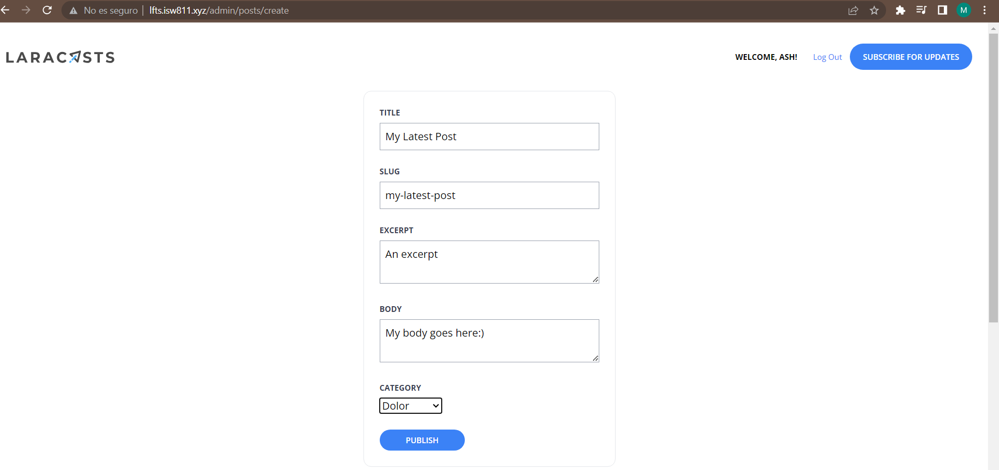
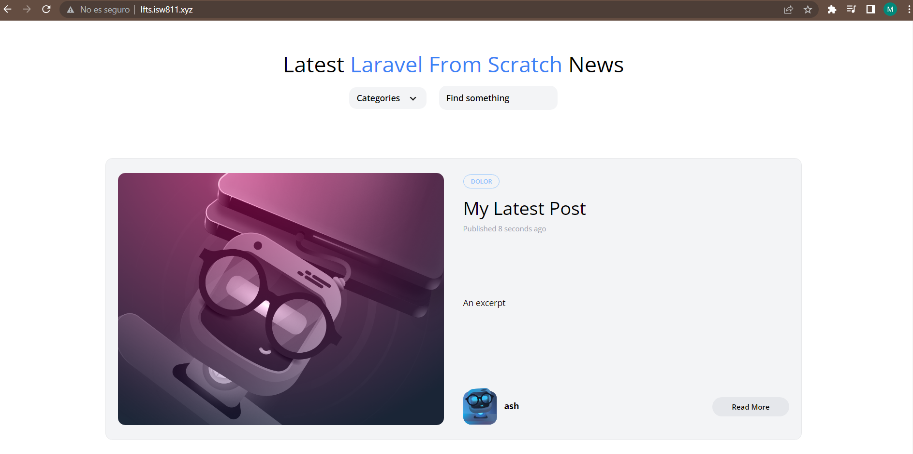

[< Volver al índice](/docs/readme.md)

# Create the Publish Post Form

A continuación, crearemos el formulario para publicar un post en `resources/views/posts/create.blade.php`, en el cual dejará al usuario ingresar un titulo, slug, excerpt, contenido y su categoría, las cuales serán las que hayan en la base de datos. También le enviaremos un error al usuario en caso de; por ejemplo, los slug son únicos ya que son los identificadores de los post en las rutas.  

```php
    <x-layout>
        <section class="px-6 py-8">
            <x-panel class="max-w-sm mx-auto">
                <form method="POST" action="/admin/posts">
                    @csrf

                    <div class="mb-6">
                        <label class="block mb-2 uppercase font-bold text-xs text-gray-700" for="title">
                            Title
                        </label>
                        <input class="border border-gray-400 p-2 w-full" type="text" name="title" id="title" value="{{ old('title') }}" required>
                        @error('title')
                            <p class="text-red-500 text-xs mt-2">{{ $message }}</p>
                        @enderror
                    </div>

                    <div class="mb-6">
                        <label class="block mb-2 uppercase font-bold text-xs text-gray-700" for="slug">
                            Slug
                        </label>
                        <input class="border border-gray-400 p-2 w-full" type="text" name="slug" id="slug" value="{{ old('slug') }}" required>
                        @error('slug')
                            <p class="text-red-500 text-xs mt-2">{{ $message }}</p>
                        @enderror
                    </div>

                    <div class="mb-6">
                        <label class="block mb-2 uppercase font-bold text-xs text-gray-700" for="excerpt">
                            Excerpt
                        </label>
                        <textarea class="border border-gray-400 p-2 w-full" name="excerpt" id="excerpt" required>{{ old('excerpt') }}</textarea>
                        @error('excerpt')
                            <p class="text-red-500 text-xs mt-2">{{ $message }}</p>
                        @enderror
                    </div>

                    <div class="mb-6">
                        <label class="block mb-2 uppercase font-bold text-xs text-gray-700" for="body" >
                            Body
                        </label>
                        <textarea class="border border-gray-400 p-2 w-full" name="body" id="body" required>{{ old('body') }}</textarea>
                        @error('body')
                            <p class="text-red-500 text-xs mt-2">{{ $message }}</p>
                        @enderror
                    </div>

                    <div class="mb-6">
                        <label class="block mb-2 uppercase font-bold text-xs text-gray-700" for="category_id">
                            Category
                        </label>
                        <select name="category_id" id="category_id">
                            @foreach (\App\Models\Category::all() as $category)
                                <option value="{{ $category->id }}"  {{ old('category_id') == $category->id ? 'selected' : '' }}>
                                    {{ ucwords($category->name) }}
                                </option>
                            @endforeach
                        </select>
                        @error('category')
                            <p class="text-red-500 text-xs mt-2">{{ $message }}</p>
                        @enderror
                    </div>

                    <x-submit-button>Publish</x-submit-button>

                </form>
            </x-panel>
        </section>
    </x-layout>
```

En el controlador del post en `app/Http/Controllers/PostController.php` validamos los datos enviados por el formulario, ya que el slug debe ser único, la categoría debe existir, y al final enlazamos el post con el usuario. 

```php
    public function store()
    {
        $attributes = request()->validate([
            'title' => 'required',
            'slug' => ['required', Rule::unique('posts', 'slug')],
            'excerpt' => 'required',
            'body' => 'required',
            'category_id' => ['required', Rule::exists('categories', 'id')]
        ]);

        $attributes['user_id'] = auth()->id();

        Post::create($attributes);

        return redirect('/');
    }
```

Crearemos nuestra respectiva ruta en `routes/web.php` la cual recibe los datos enviados por el formulario por el método POST, además es una acción que solo el administrador puede realizar, ya que le pondremos su middleware.

```php
    Route::post('admin/posts', [PostController::class, 'store'])->middleware('admin');
```


