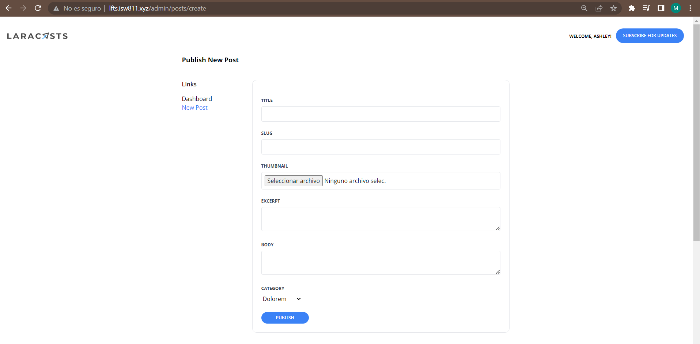

[< Volver al índice](/docs/readme.md)

# Extend the Admin Layout

Si seguimos aplicando los componente Blade entonces nuestro registro quedaría de la siguiente manera; `resources/views/register/create.blade.php`.

```html
    <x-layout>
        <section class="px-6 py-8">
            <main class="max-w-lg mx-auto mt-10">
                <x-panel>
                    <h1 class="text-center font-bold text-xl">Register!</h1>

                    <form method="POST" action="/register" class="mt-10">
                        @csrf

                        <x-form.input name="name" />
                        <x-form.input name="username" />
                        <x-form.input name="email" type="email" />
                        <x-form.input name="password" type="password" autocomplete="new-password" />
                        <x-form.button>Sign Up</x-form.button>
                    </form>
                </x-panel>
            </main>
        </section>
    </x-layout>
```

Y el login `resources/views/sessions/create.blade.php`. 

```html
    <x-layout>
        <section class="px-6 py-8">
            <main class="max-w-lg mx-auto mt-10">
                <x-panel>
                    <h1 class="text-center font-bold text-xl">Log In!</h1>

                    <form method="POST" action="/login" class="mt-10">
                        @csrf

                        <x-form.input name="email" type="email" autocomplete="username"/>
                        <x-form.input name="password" type="password" autocomplete="current-password"/>

                        <x-form.button>Log In</x-form.button>
                    </form>
                </x-panel>
            </main>
        </section>
    </x-layout>
```

En este episodio, agregaremos un menú desplegable de la cuenta del usuario en `resources/views/components/layout.blade.php`, el cual tendrá la opción de ir al dashboard del administrador, crear un post y cerrar sesión.

```html
    <nav class="md:flex md:justify-between md:items-center">
        <div>
            <a href="/">
                
            </a>
        </div>

        <div class="mt-8 md:mt-0 flex items-center">
            @auth
                <x-dropdown>
                    <x-slot name="trigger">
                        <button class="text-xs font-bold uppercase">Welcome, {{ auth()->user()->name }}!</button>
                    </x-slot>

                    <x-dropdown-item href="/admin/dashboard">Dashboard</x-dropdown-item>
                    <x-dropdown-item href="/admin/posts/create" :active="request()->is('admin/posts/create')">New Post</x-dropdown-item>
                    <x-dropdown-item href="#" x-data="{}" @click.prevent="document.querySelector('#logout-form').submit()">Log Out</x-dropdown-item>

                    <form id="logout-form" method="POST" action="/logout" class="hidden">
                        @csrf
                    </form>
                    
                </x-dropdown> 
            @else
                <a href="/register" class="text-xs font-bold uppercase {{ request()->is('register') ? 'text-blue-500' : '' }}">Register</a>
                <a href="/login" class="ml-6 text-xs font-bold uppercase {{ request()->is('login') ? 'text-blue-500' : '' }}">Log In</a>
            @endauth
            <a href="#newsletter" class="bg-blue-500 ml-3 rounded-full text-xs font-semibold text-white uppercase py-3 px-5">
                Subscribe for Updates
            </a>
        </div>
    </nav>
```

Se creará un nuevo componente en `resources/views/components/setting.blade.php` para hacer una barra de configuraciones para el administrador, los cuales serán los mismos link del menú desplegable. 

```html
    @props(['heading'])

    <section class="py-8 max-w-4xl mx-auto">
        <h1 class="text-lg font-bold mb-8 pb-2 border-b">
            {{ $heading }}
        </h1>

        <div class="flex">
            <aside class="w-48">
                <h4 class="font-semibold mb-4">Links</h4>

                <ul>
                    <li>
                        <a href="/admin/dashboard" class="{{ request()->is('admin/dashboard') ? 'text-blue-500' : '' }}">Dashboard</a>
                    </li>

                    <li>
                        <a href="/admin/posts/create" class="{{ request()->is('admin/posts/create') ? 'text-blue-500' : '' }}">New Post</a>
                    </li>
                </ul>
            </aside>

            <main class="flex-1">
                <x-panel>
                    {{ $slot }}
                </x-panel>
            </main>
        </div>
    </section>
```

Para finalizar agregamos nuestro componente Blade a `resources/views/posts/create.blade.php` para inicializarlo. 

```php
   <x-setting heading="Publish New Post">
```

