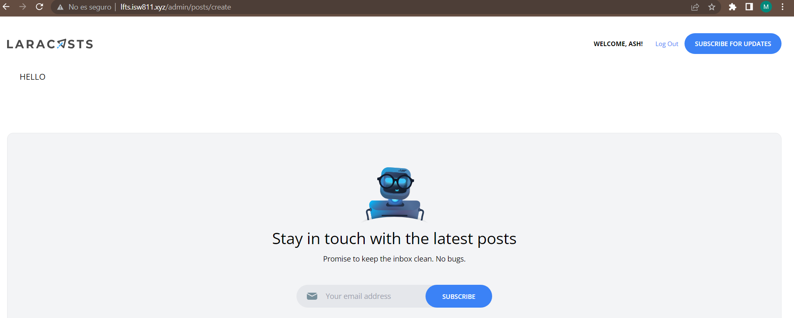

[< Volver al índice](/docs/readme.md)

# Limit Access to Only Admins

En este módulo trabajaremos en la sección de administrador. Antes de comenzar a realizar el formulario, primero, digitaremos el siguiente comando en nuestra maquina virtual para crear un middleware con la intención de que solo el administrador pueda acceder a una pagina en especifico.

```bash
    php artisan make:middleware MustBeAdministrator
```

Eso creará nuestro middleware en `app/Http/Middleware` en la cual definiremos el usuario de nuestro administrador haciendo que si el usuario logueado no es el administrador, se le retorna un error 404. 

```php
    public function handle(Request $request, Closure $next)
    {
        if (optional(auth()->user())->username !== 'ash01') { abort(Response::HTTP_FORBIDDEN); }
        return $next($request);
    }
```

Para que el middleware funcione, vamos a agregarlo en `àpp/Http/Kernel.php` donde se encuentra todos aquellas restricciones de las rutas. 

```php
    use App\Http\Middleware\MustBeAdministrator;
```
```php
    protected $routeMiddleware = [
            'admin' => MustBeAdministrator::class,
            ...
    ];
```
Crearemos una vista con datos de prueba del contenido del administrador en `resources/views/posts/create.blade.php`.

```html
    <x-layout>
        <section class="px-6 py-8">
            HELLO
        </section>
    </x-layout>
```
En `app/Http/Controllers/PostController.php` retornaremos la vista *create.blade.php*.

```php
    public function create()
    {
        return view('posts.create');
    }
```
Para asegurarnos de eso agregaremos la ruta el respectivo middleware. 
```php
    Route::get('admin/posts/create', [PostController::class, 'create'])->middleware('admin');
```

