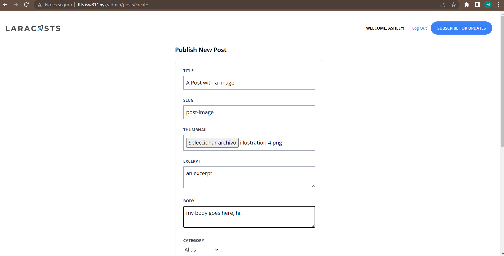
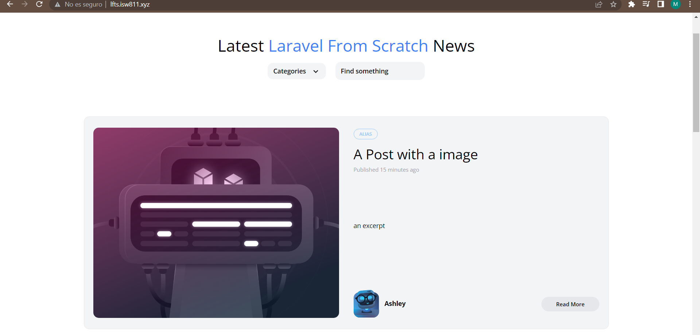

[< Volver al índice](/docs/readme.md)

# Validate and Store Post Thumbnails

En este episodio veremos como cargar una imagen al Post desde el disco local. Primero debemos agregar la siguiente entrada en nuestra vista `resources/views/posts/create.blade.php` para permitirle al usuario agregar una imagen. 

```html
    <div class="mb-6">
        <label class="block mb-2 uppercase font-bold text-xs text-gray-700" for="thumbnail">
            Thumbnail
        </label>

        <input class="border border-gray-400 p-2 w-full" type="file" name="thumbnail" id="thumbnail" required>

        @error('thumbnail')
            <p class="text-red-500 text-xs mt-2">{{ $message }}</p>
        @enderror
    </div>
```

Cambiamos que en nuestro controlador `app/Http/Controllers/PostController.php` requiera una imagen, y la imagen se va almacenar en en nuestro proyecto. 

```php
    public function store()
    {
        $attributes = request()->validate([
            'title' => 'required',
            'thumbnail' => 'required|image',
            'slug' => ['required', Rule::unique('posts', 'slug')],
            'excerpt' => 'required',
            'body' => 'required',
            'category_id' => ['required', Rule::exists('categories', 'id')]
        ]);

        $attributes['user_id'] = auth()->id();
        $attributes['thumbnail'] = request()->file('thumbnail')->store('thumbnails');

        Post::create($attributes);

        return redirect('/');
    }
```
Cambiamos la estructura de la tabla de la base de datos para que permita agregar una imagen en `database/migrations/create_posts_table.php`:

```php
    public function up()
    {
        Schema::create('posts', function (Blueprint $table) {
            $table->id();
            $table->foreignId('user_id');
            $table->foreignId('category_id');
            $table->string('slug')->unique();
            $table->string('title');
            $table->string('thumbnail')->nullable();
            $table->text('excerpt');
            $table->text('body');
            $table->timestamps();
            $table->timestamp('published_at')->nullable();
       });
    }
```

Para que se almacenan los cambios vamos a ingresar el siguiente comando en nuestra maquina virtual, lo cual va a eliminar todos los datos de nuestra base de datos y crear unos nuevos. Por tanto, recordar hacer de nuevo nuestro administrador con el mismo usuario que habíamos ingresado anteriormente: 

```bash
    php artisan migrate:fresh --seed
```
Especificaremos en `config/filesystems.php` el disco del sistema de archivos: 

```php
    'default' => env('FILESYSTEM_DRIVER', 'public'),
```

Crearemos un link para la ruta `storage/app/public` para que solo se interprete que solo sea *storage*, que es la ruta donde se almacenarán las imágenes, para esto se digitará el siguiente comando en nuestra maquina virtual: 

```bash
    php artisan storage:link
```

Por ultimo cambiaremos las imagenes predeterminadas en `show.blade.php`, `post-card.blade` y `post-featured.blade.php` para que tenga la ruta de la imagen del post desde la base de datos. 

```html
    thumbnail) }}" alt="" class="rounded-xl">
```


