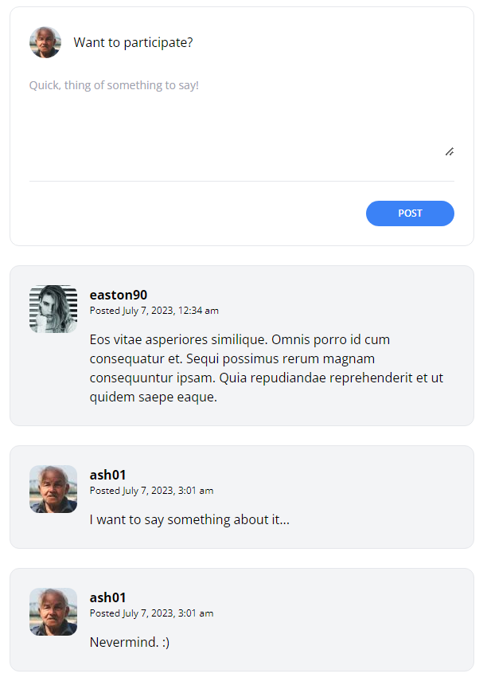

[< Volver al índice](/docs/readme.md)

# Activate the Comment Form

Ahora que el formulario de comentarios está completamente diseñado, podemos agregar la lógica necesaria para que los usuarios ingresen comentarios a la base de datos por medio del formulario. Para esto vamos a necesitar un controlador `app/Http/Controllers/PostCommentsController.php`, entonces ingresamos el siguiente comando a nuestra maquina virtual: 

```bash
    php artisan make:controller PostCommentsController
```

En el controlador que se creo, digitamos la siguiente función la cual valida que el usuario haya agregado texto, y luego crea el comentario. 

```php
    public function store(Post $post)
    {
        request()->validate([
            'body' => 'required'
        ]);

        $post->comments()->create([
            'user_id' => request()->user()->id,
            'body' => request('body')
        ]);

        return back();
    }
```
Recordar que tenemos una vista con un panel de comentarios, en `resources/views/posts/show.blade.php` en el cual vamos a verificar que el usuario este logueado por medio de *auth* y sino le indicamos por medio de unos links que se puede registrar o loguearse. Todo este formulario esta bajo el método post, para enviarnos los datos, por tanto necesitamos un endpoint. 

```html
    <section class="col-span-8 col-start-5 mt-10 space-y-6">
        @auth
            <x-panel>
                <form method="POST" action="/posts/{{ $post->slug }}/comments">
                    @csrf

                    <header class="flex items-center">
                        id() }}"
                            alt=""
                            width="40"
                            height="40"
                            class="rounded-full"
                        />

                        <h2 class="ml-4">Want to participate?</h2>
                    </header>

                    <div class="mt-6">
                        <textarea
                            name="body"
                            class="w-full text-sm focus:outline-none focus:ring"
                            rows="5"
                            placeholder="Quick, thing of something to say!"
                            required
                        ></textarea>
                    </div>

                    <div class="flex justify-end mt-6 pt-6 border-t border-gray-200">
                        <button
                            type="submit"
                            class="bg-blue-500 text-white uppercase font-semibold text-xs py-2 px-10 rounded-2xl hover:bg-blue-600"
                        >
                            Post
                        </button>
                    </div>
                </form>
            </x-panel>
        @else
            <p class="font-semibold">
                <a href="/register" class="hover:underline">Register</a> or
                <a href="/login" class="hover:underline">Log in</a> to leave a comment.
            </p>
        @endauth 
        @foreach ($post->comments as $comment)
            <x-post-comment :comment="$comment" />
        @endforeach
    </section>
```

El cual irá en `routes/web.php`, llamando debidamente nuestro controlador, y función para crear el comentario. 

```php
    Route::post('posts/{post:slug}/comments', [PostCommentsController::class, 'store']);
```

En el modelo del comentario `app/Models/Comments.php` tenemos un *$fillable* el cual solo acepta aquellos datos que se encuentren en estos parámetros, sin embargo para evitarnos mas conflictos con esta condición pondremos *$guarded* que hace lo contrario que el anterior, excluye de ingresar a la base de datos todo aquel parámetro que contenga.

```php
    protected $guarded = [];
```


