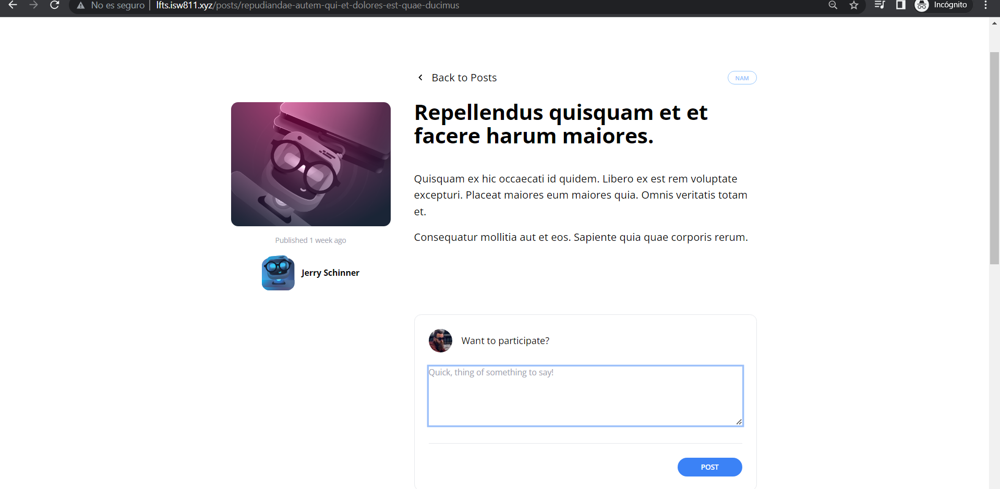

[< Volver al índice](/docs/readme.md)

# Design the Comment Form

Ahora que cada publicación puede mostrar una lista de comentarios, vamos a crear un formulario para permitir que cualquier usuario autenticado participe en la conversación. Primero, vamos a crear una vista llamada `panel.blade.php` en el directorio `resources/views/components`, donde llamamos el estilo del panel de los comentarios. 

```html
    <div {{ $attributes(['class' => 'border border-gray-200 p-6 rounded-xl']) }}>
        {{ $slot }}
    </div>
```
Llamamos el componente *panel* en la vista `resources/views/posts/show.blade.php`, donde, dentro de este, crearemos un formulario donde el usuario pueda ingresar comentarios al post. 

```html
    <section class="col-span-8 col-start-5 space-y-6">
        <x-panel>
            <form method="POST" action="/posts/{{ $post->slug }}/comments">
                @csrf

                <header class="flex items-center">
                    id() }}"
                        alt=""
                        width="40"
                        height="40"
                        class="rounded-full"
                    />

                    <h2 class="ml-4">Want to participate?</h2>
                </header>

                <div class="mt-6">
                    <textarea
                        name="body"
                        class="w-full text-sm focus:outline-none focus:ring"
                        rows="5"
                        placeholder="Quick, thing of something to say!"
                        required
                    ></textarea>
                </div>

                <div class="flex justify-end mt-6 pt-6 border-t border-gray-200">
                    <button
                        type="submit"
                        class="bg-blue-500 text-white uppercase font-semibold text-xs py-2 px-10 rounded-2xl hover:bg-blue-600"
                    >
                        Post
                    </button>
                </div>
            </form>
        </x-panel>
        @foreach ($post->comments as $comment)
            <x-post-comment :comment="$comment"/>
        @endforeach
    </section>
```

 
