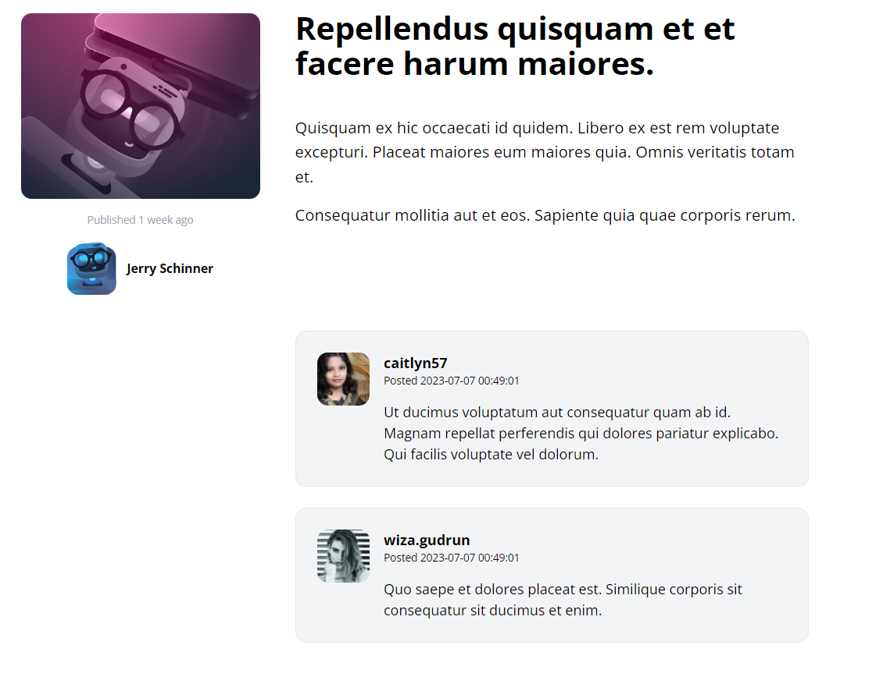

[< Volver al índice](/docs/readme.md)

# Make the Comments Section Dynamic

Ahora tenemos una tabla en la base de datos de comentarios pero el contenido de estos aparecen de manera predeterminada en la pagina, por eso,  tenemos que hacerlos dinámicos, en la cual extraigamos el contenido desde la base de datos. Primeramente, en el fabrica de los comentarios, haremos que al crearlos estos estén relacionados con la fabrica de *user* y *post*, ademas de crear un *body* aleatorio; `app/database/factories/CommentFactory.php`.

```php
    public function definition()
    {
       return [
           'post_id' => Post::factory(),
           'user_id' => User::factory(),
           'body' => $this->faker->paragraph()
        ];
   }
```
Luego ingresamos el siguiente comando en nuestra maquina virtual para crearlos: 

```bash
php artisan tinker
App\Models\Comment::factory()->create();
```
En el modelo del post establecemos la relación con los comentarios, la cual un post puede tener muchos comentarios; `app/Models/Post.php`.

```php
    public function comments()
    {
        return $this->hasMany(Comment::class);
    }
```
Así como, en el modelo de los comentarios establecemos que un comentario solo puede pertenecer a un post y a un usuario; `app/Models/Comment.php`. 

```php
    public function post()
    {
        return $this->belongsTo(Post::class);
    }

    public function author()
    {
        return $this->belongsTo(User::class, 'user_id');
    }
```

Para extraer los comentarios desde la base de datos debemos tener un ciclo en el cual llamamos todos los comentarios del post y llamamos el componente del comentario; `resources/views/posts/show.blade.php`.

```php
    <section class="col-span-8 col-start-5 space-y-6">
        @foreach ($post->comments as $comment)
            <x-post-comment :comment="$comment"/>
        @endforeach
    </section>
```

En el componente comentario en `resources/views/components/post-comment.blade.php``establecemos donde queremos el nombre de usuario, fecha, contenido, además con *?u={{$comment->id}}* hace que la foto del usuario sea única.

```html
    @props(['comment'])
    <article class="flex bg-gray-100 border border-gray-200 p-6 rounded-xl space-x-4">
    
        <div class="flex-shrink-0">
            id}}" alt="" width="60" height="60" class="rounded-xl">
        </div>

        <div>
            
            <header class="mb-4">
                <h3 class="font-bold">{{$comment->author->username}}</h3>

                <p class="text-xs">
                    Posted
                    <time>{{$comment->created_at}}</time>
                </p>

            </header>

            <p>
                {{$comment->body}}
            </p>

        </div>
    </article>
```
