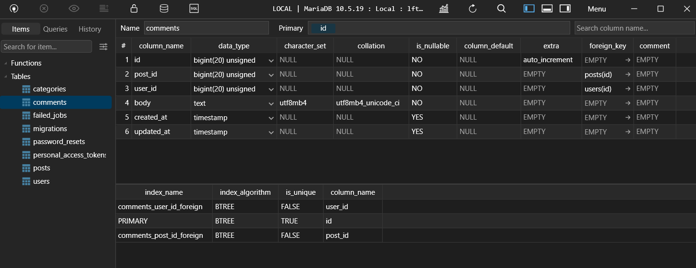

[< Volver al índice](/docs/readme.md)

# Table Consistency and Foreign Key Constraints

A continuación, haremos la migración y la tabla en la base de datos para los comentarios. Primero debemos ingresar el siguiente comando en nuestra maquina virtual, la cual nos permitirá crear un modelo(m), fabrica(f), y un controlador(c) para nuestros comentarios. 

```bash
    php artisan make:model Comment -mfc
```
Además de esos archivos también nos crea la migración para poder crear la estructura de la tabla en `app/database/migrations/create_comments_table`. Tendremos los id de las tablas *post* y *user* asociados a la tabla *comments*, por tanto, con *cascadeOnDelete()* haremos que al eliminar un post asociado a un comentario también elimina el comentario. 

```php
    public function up()
    {
        Schema::create('comments', function (Blueprint $table) {
            $table->id();
            $table->foreignId('post_id')->constrained()->cascadeOnDelete();
            $table->foreignId('user_id')->constrained()->cascadeOnDelete();
            $table->text('body');
            $table->timestamps();
        });
    }
```
Por ultimo, para que los cambios se vean reflejados en nuestra base de datos, ingresamos el siguiente comando en nuestra maquina virtual: 

```bash
    php artisan migrate
```


