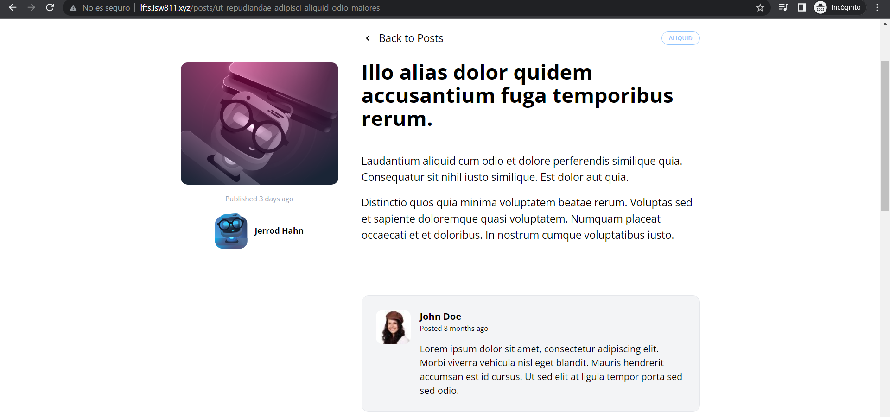

[< Volver al índice](/docs/readme.md)

# Write the Markup for a Post Comment

En este episodio agregaremos un espacio para los comentarios de los posts. Primeramente, crearemos un archivo en `resources/views/components` llamado `post-comment.blade.php` en el cual pondremos el contenido de cada comentario, el cual, agregaremos la foto del autor, la fecha, y el texto. 

```php
    <article class="flex bg-gray-100 border border-gray-200 p-6 rounded-xl space-x-4">
        <div class="flex-shrink-0">
            
        </div>

        <div>
            <header class="mb-4">
                <h3 class="font-bold">John Doe</h3>

                <p class="text-xs">
                    Posted
                    <time>8 months ago</time>
                </p>
            </header>

            <p>
                Lorem ipsum dolor sit amet, consectetur adipiscing elit. Morbi
                viverra vehicula nisl eget blandit. Mauris hendrerit accumsan est id
                cursus. Ut sed elit at ligula tempor porta sed sed odio.
            </p>
        </div>
    </article>
```

Además, para llamar este componente debemos agregar un sección en `resources/views/posts/show.blade.php`.

```php
    <section class="col-span-8 col-start-5 mt-10 space-y-6">
        <x-post-comment />
        <x-post-comment />
        <x-post-comment />
        <x-post-comment />
    </section>
```

