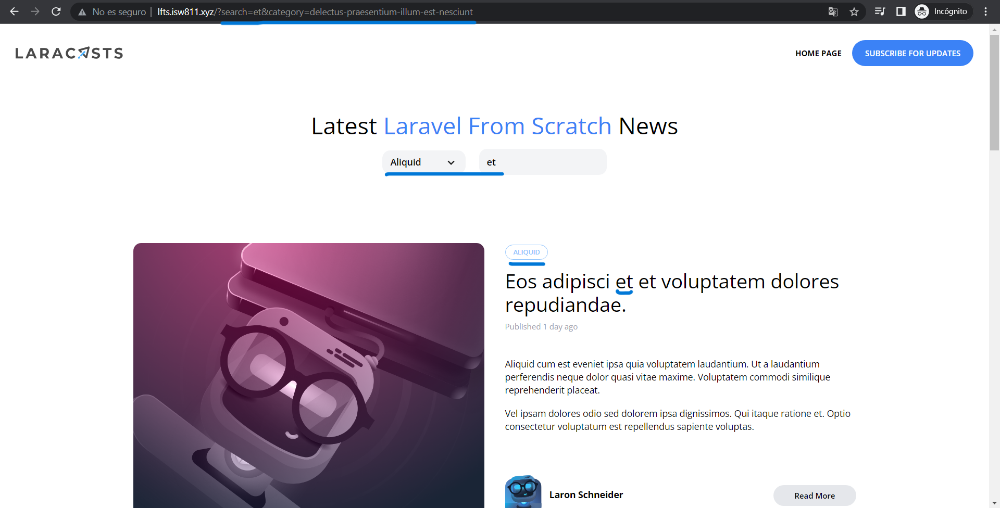

[< Volver al índice](/docs/readme.md)

# Advanced Eloquent Query Constraints

Continuemos con las consultas *filter()*. Esta vez filtraremos los posts por su categoría y a su vez utilizando el filtro del input de búsqueda. 

Primero, solicitamos que nos devuelven los posts donde el slug de la categoría coincida con lo que usuario solicite en *app/Models/Post.php*, además, de filtrar los post por su título y categoría.

```php
    public function scopeFilter($query, array $filters)
    {
        $query->when($filters['search'] ?? false, fn($query, $search) =>
            $query
                ->where('title', 'like', '%' . $search . '%')
                ->orWhere('body', 'like', '%' . $search . '%'));

        $query->when($filters['category'] ?? false, fn($query, $category) =>
            $query->whereHas('category', fn ($query) =>
                $query->where('slug', $category)
            )
        );
    }
```

Luego haremos que el controlador retorne las vistas con los filtros ya aplicados en *app/Http/Controllers/PostController.php*.

```php
    public function index()
    {
        return view('posts', [
            'posts' => Post::latest()->filter(request(['search', 'category']))->get(),
            'categories' => Category::all(),
            'currentCategory' => Category::firstWhere('slug', request('category'))
        ]);
    }
```

En la sección de categoría en *_post-header.blade.php* cambiamos el foreach que tenemos por: 

```php
    @foreach ($categories as $category)
        <x-dropdown-item
            href="/?category={{ $category->slug }}"
            :active='request()->is("categories/{$category->slug}")'
            >{{ ucwords($category->name) }}
        </x-dropdown-item>
    @endforeach
```
Esto era nuestro menú desplegable, lo que en su ruta va a cambiar porque ahora se van a aceptar nuevos parámetros. Por tanto, ya no vamos a necesitar la siguiente ruta en *routes/web.php*

```php
Route::get('categories/{category:slug}', function (Category $category) {
   return view('posts', [
       'posts'=> $category->posts,
         'currentCategory' => $category,
        'categories' => Category::all()
    ]);
 })->name('home');
 ```


