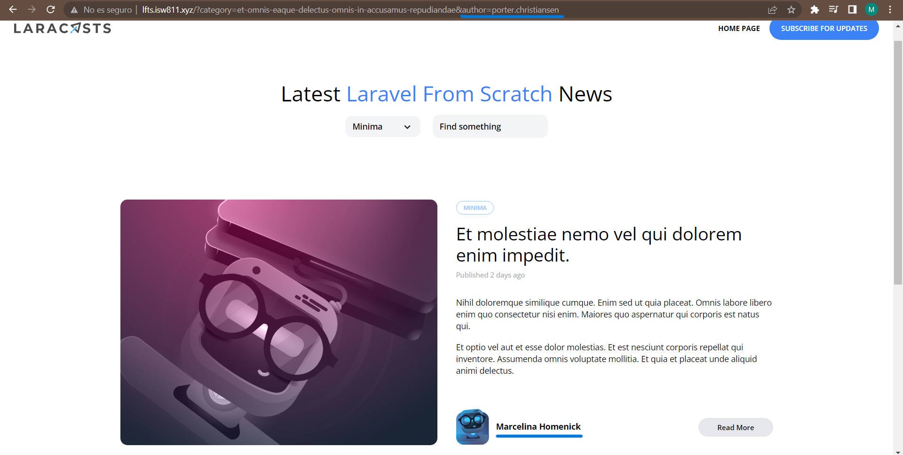

[< Volver al índice](/docs/readme.md)

# Author Filtering

A continuación, agregaremos un filtro a las publicaciones según su autor respectivo. Para esto primero debemos hacer clicleable el nombre, y además cambiamos la URL con el username del autor. El siguiente código se agrega en `post-card.blade.php`, `post-featured.blade.php` y `show.blade.php`. 

```html
    <div class="ml-3">
        <h5 class="font-bold">
            <a href="/?author={{ $post->author->username }}"
                >{{ $post->author->name }}</a
            >
        </h5>
    </div>
```

Al cambiar la URL por medio del link ya no necesitamos la siguiente ruta en `routes/web.php`:

```php
    Route::get('authors/{author:username}', function (User $author) {
        return view('posts', [
            'posts'=> $author->posts
        ]);
    });
```

Crearemos un *query* con el filtro del autor en `app/Models/Post.php` el cual nos verificará que el username del autor coincida con el username del post y retornarlos. 

```php
    $query->when($filters['author'] ?? false, fn($query, $author) =>
        $query->whereHas('author', fn ($query) =>
            $query->where('username', $author)
        )
    );
```

Pero ahora bien, al cambiar la URL, debemos de retornar una vista con todos los posts filtrador para esto lo haremos en el controlador en `app/Http/Controllers/PostController.php`. Estos parámetros devolver su vista según su filtro. 

```php
    public function index()
    {
        return view('posts.index', [
            'posts' => Post::latest()->filter(request(['search', 'category', 'author']))->get()
        ]);
    }
```

