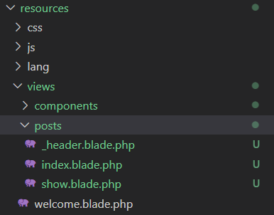

[< Volver al índice](/docs/readme.md)

# Extract a Category Dropdown Blade Component

Vamos a renderizar el código de la aplicación para esto vamos crear un componente que solo llame el menú desplegable de categoría en el header. Para esto vamos a ingresar el siguiente comando en nuestra maquina virtual: 

```bash
    php artisan make:component CategoryDropdown
```

Esto creará un archivo `category-dropdown.blade.php` en `resources/views/components`, en el cual vamos a pasar el código del menú desplegable, y queda de la siguiente manera: 

```php
    <x-dropdown>
        <x-slot name="trigger">
            <button
                class="py-2 pl-3 pr-9 text-sm font-semibold w-full lg:w-32 text-left flex lg:inline-flex"
            >
                {{ isset($currentCategory) ? ucwords($currentCategory->name) :
                'Categories' }}
                <x-icon
                    name="down-arrow"
                    class="absolute pointer-events-none"
                    style="right: 12px;"
                />
                <x-icon name="down-arrow" class="absolute pointer-events-none" style="right: 12px;"/>
            </button>
        </x-slot>

        <x-dropdown-item href="/" :active="request()->routeIs('home')"
            >All</x-dropdown-item
        >

        @foreach ($categories as $category)
            <x-dropdown-item
                href="/?category={{ $category->slug }}"
                :active='request()->is("categories/{$category->slug}")'
                >{{ ucwords($category->name) }}
            </x-dropdown-item>
        @endforeach
    </x-dropdown>
```
De esta manera en `_post-header.blade.php` la sección categoría solo llamamos el componente: 

```html
    <!--  Category -->
    <div class="relative lg:inline-flex bg-gray-100 rounded-xl">
        <x-category-dropdown/>
    </div>
```
De igual forma, también crea una vista en `app/View/Components/CategoryDropdown.php` en el cual vamos retornar todas las vistas o solo la vista que coincida con el slug de la categoría cuando el usuario la elija en el menú desplegable. 

```php
        use App\Models\Category;
        
        class CategoryDropdown extends Component
        {
            public function render()
            {
                return view('components.category-dropdown', [
                    'categories' => Category::all(),
                    'currentCategory' => Category::firstWhere('slug', request('category'))
                ]);
            }
        }
```

Por tanto ya no se necesita retornar categorías en ningún otro componente como en `routes/web.php`. 

```php
    Route::get('authors/{author:username}', function (User $author) {
        return view('posts', [
            'posts'=> $author->posts
        ]);
    });
```

También ya no hacemos mención de categorías en `app/Http/Controllers/PostController.php` y además les hacemos mención de sus vistas a cada función con *.show* y *.index* ya que les vamos a cambiar el nombre.

```php
    public function index()
    {
        return view('posts.index', [
            'posts' => Post::latest()->filter(request(['search', 'category']))->get()
        ]);
    }
    
    public function show(Post $post)
    {
        return view('post.show', [
            'post' => $post
        ]);
    }
```

Crearemos un nuevo directorio en `resources/views/posts` y movemos `_post-header.blade.php` que ahora se va a llamar `_header.blade.php`, `post.blade.php` ahora se llamará `show.blade.php`, y por ultimo, `posts.blade.php` le cambiaremos el nombre a `index.blade.php`.
\

\
Al cambiarle el nombre a estos componentes debemos llamarlos correctamente, por tanto en `index.blade.php` vamos a llamar el header con el nuevo nombre.

```php
    @include('posts._header') 
```

De esta manera hemos renderizado el código de la aplicación. 