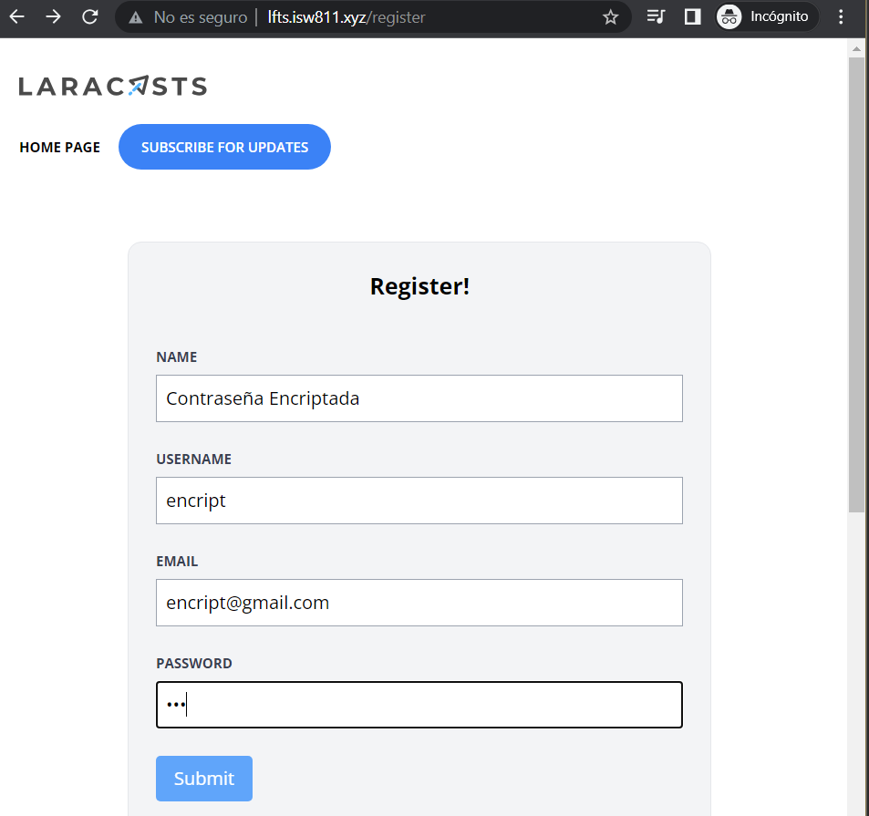
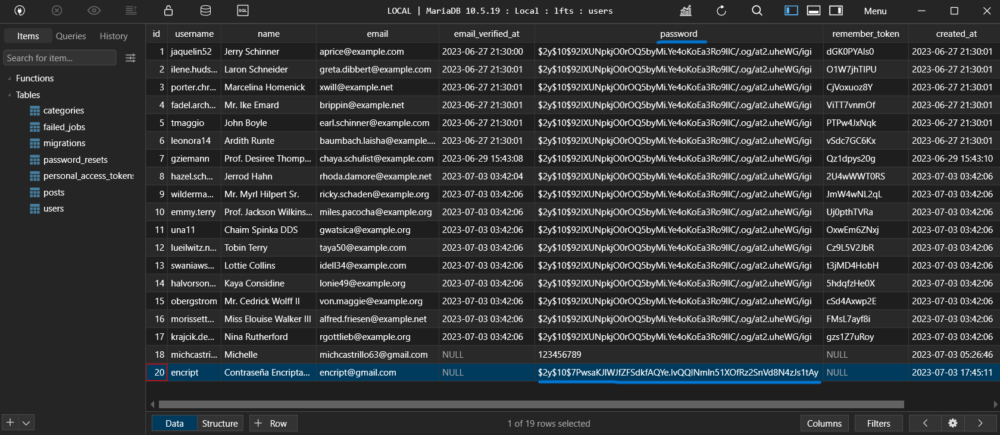

[< Volver al índice](/docs/readme.md)

# Automatic Password Hashing With Mutators

En el episodio anterior las contraseñas se podían visualizar en la base de datos, lo que significa un riesgo en la privacidad de los usuarios. Aprovecharemos los mutadores de Eloquent para asegurarnos de que las contraseñas siempre se encripten antes de que se guarden. Para esto, vamos agregar esta función en `app/Models/User.php`.

```php
    public function setPasswordAttribute($password)
    {
        $this->attributes['password'] = bcrypt($password);
    }
```
El método setPasswordAttribute es utilizado como mutador que se encarga de editar la contraseña para encriptarla.  


