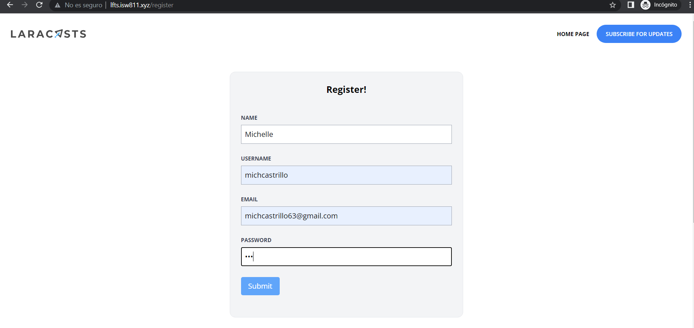
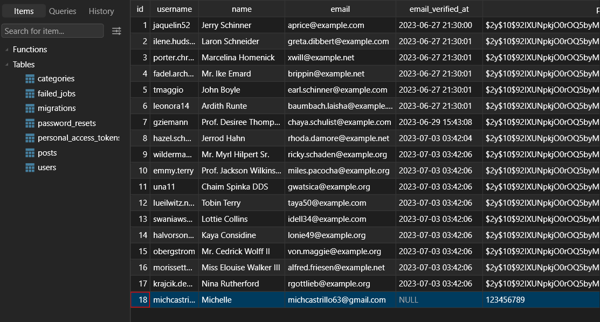

[< Volver al índice](/docs/readme.md)

# Build a Register User Page

En este capitulo se vera el manejo de formularios y la autenticación de usuarios en un registro. Lo primero que haremos es crear un controlador para que retorne la vista de nuestro formulario y cree el usuario, para esto vamos a digitar el siguiente comando en nuestra maquina virtual: 

```bash
    php artisan make:controller RegisterController
```

Esto va a crear un archivo en `app/Http/Controllers/RegisterController`, en el cual pondremos dos funciones, *create()* que retornará nuestra vista y *store()* que será el encargado de verificar si lo que ingresa el usuario cumple con los requisitos mínimos, crea el usuario, y lo redirecciona a la pagina principal. 

```php
    use App\Models\User;
```
```php
   
    public function create(){
        return view('register.create');
    }

    public function store()
    {
        $attributes = request()->validate([
            'name' => 'required|max:255',
            'username' => 'required|min:3|max:255',
            'email' => 'required|email|max:255',
            'password' => 'required|min:3|max:255',
        ]);

        User::create($attributes);

        return redirect('/');
    }
```

Crearemos nuestra vista en el cual pondremos todo el contenido y estilo de nuestro formulario en una nuestro nuevo directorio `resources/views/register/create.blade.php`. El form tiene que ser del método *POST* para poder almacenar almacenar los datos en una base de datos. 

```html
    <x-layout>
        <section class="px-6 py-8">
            <main class="max-w-lg mx-auto mt-10 bg-gray-100 border border-gray-200 p-6 rounded-xl">
                <h1 class="text-center font-bold text-xl">Register!</h1>
                <form method="POST" action="/register" class="mt-10">
                    @csrf
                    <div class="mb-6">
                        <label class="block mb-2 uppercase font-bold text-xs text-gray-700" for="name">
                            Name
                        </label>
                        <input class="border border-gray-400 p-2 w-full" type="text" name="name" id="name" required>
                    </div>
                    <div class="mb-6">
                        <label class="block mb-2 uppercase font-bold text-xs text-gray-700" 
                        for="username">
                            Username
                        </label>
                        <input class="border border-gray-400 p-2 w-full" type="text" name="username" id="username" required>
                    </div>
                    <div class="mb-6">
                        <label class="block mb-2 uppercase font-bold text-xs text-gray-700" for="email">
                            Email
                        </label>
                        <input class="border border-gray-400 p-2 w-full" type="email" name="email" id="email" required>
                    </div>
                    <div class="mb-6">
                        <label class="block mb-2 uppercase font-bold text-xs text-gray-700" for="password">
                            Password
                        </label>
                        <input class="border border-gray-400 p-2 w-full" type="password" name="password" id="password" required>
                    </div>
                    <div class="mb-6">
                        <button type="submit" class="bg-blue-400 text-white rounded py-2 px-4 hover:bg-blue-500">
                            Submit
                        </button>
                    </div>
                </form>
            </main>
        </section>
    </x-layout>
```

Recordar agregar nuestras rutas de registro, en el cual recibiremos la vista según el controlador de register, y se almacenan los datos del usuario solo si se verifica que todos los datos estén correctos. 

```php
    use App\Http\Controllers\RegisterController;

    Route::get('register', [RegisterController::class, 'create']);
    Route::post('register', [RegisterController::class, 'store']);
```
En `app/Models/User.php` tenemos un *$fillable* el cual solo acepta aquellos datos que se encuentren en estos parámetros, sin embargo para evitarnos mas conflictos con esta condición pondremos *$guarded* que hace lo contrario que el anterior, excluye de ingresar a la base de datos todo aquel parámetro que contenga. 

```php
    protected $guarded = [];
```


