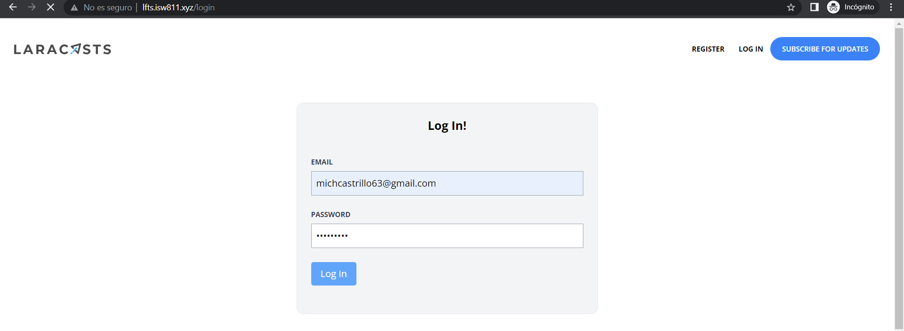

[< Volver al índice](/docs/readme.md)

# Build the Log In Page

A continuación, haremos la vista del login. Para esto creamos dos rutas nuevas, una para obtener la vista del login y otra con método *post* para obtener lo que se envía por medio del formulario y validarlo en `routes/web.php`. 

```php
    Route::get('login', [SessionsController::class, 'create'])->middleware('guest');
    Route::post('login', [SessionsController::class, 'store'])->middleware('guest');
```

En el controlador `app/Controllers/SessionsController.php` retornamos la vista del login en *create* y en *store* indicamos que en el email y la contraseña sean obligatorios, luego se verifica si los datos están en la base de datos, si es así, se redirecciona a la pagina principal con un mensaje de bienvenida, sino se le manda un mensaje de error. 

```php
    public function create()
    {
        return view('sessions.create');
    }

    public function store()
    {
        $attributes = request()->validate([
            'email' => 'required|email',
            'password' => 'required'
        ]);

        if (auth()->attempt($attributes)) {
            session()->regenerate();

            return redirect('/')->with('success', 'Welcome Back!');
        }

        throw ValidationException::withMessages([
            'email' => 'Your provided credentials could not be verified.'
        ]);
    }
```
Por ultimo, creamos un nuevo directorio para la vista del login llamado *create.blade.php* en el directorio `resources/views/sessions`, donde ponemos unos inputs para que el usuario puede colocar su correo electrónico y su contraseña: 

```php
    <x-layout>
        <section class="px-6 py-8">
            <main class="max-w-lg mx-auto mt-10 bg-gray-100 border border-gray-200 p-6 rounded-xl">
                <h1 class="text-center font-bold text-xl">Log In!</h1>

                <form method="POST" action="/login" class="mt-10">
                    @csrf

                    <div class="mb-6">
                        <label class="block mb-2 uppercase font-bold text-xs text-gray-700"
                            for="email"
                        >
                            Email
                        </label>

                        <input class="border border-gray-400 p-2 w-full"
                            type="email"
                            name="email"
                            id="email"
                            value="{{ old('email') }}"
                            required
                        >

                        @error('email')
                            <p class="text-red-500 text-xs mt-2">{{ $message }}</p>
                        @enderror
                    </div>

                    <div class="mb-6">
                        <label class="block mb-2 uppercase font-bold text-xs text-gray-700"
                            for="password"
                        >
                            Password
                        </label>

                        <input class="border border-gray-400 p-2 w-full"
                            type="password"
                            name="password"
                            id="password"
                            required
                        >

                        @error('password')
                            <p class="text-red-500 text-xs mt-1">{{ $message }}</p>
                        @enderror
                    </div>

                    <div class="mb-6">
                        <button type="submit"
                                class="bg-blue-400 text-white rounded py-2 px-4 hover:bg-blue-500"
                        >
                            Log In
                        </button>
                    </div>
                </form>
            </main>
        </section>
    </x-layout>
```
