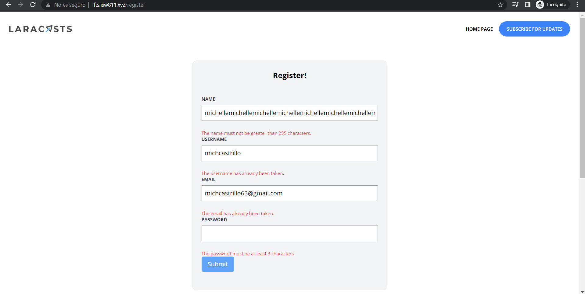

[< Volver al índice](/docs/readme.md)

# Failed Validation and Old Input Data

A continuación, debemos proporcionar comentarios al usuario cada vez que falle el verificador de validación. En estos casos, podemos utilizar *@error* Blade para representar fácilmente el mensaje de validación correspondiente de un atributo. También discutiremos cómo obtener datos de entrada antiguos. Para esto vamos a cambiar la vista de nuestro registro en `resources/views/register/create.blade.php`.

```php
    <x-layout>
        <section class="px-6 py-8">
            <main class="max-w-lg mx-auto mt-10 bg-gray-100 border border-gray-200 p-6 rounded-xl">
                <h1 class="text-center font-bold text-xl">Register!</h1>
                
                <form method="POST" action="/register" class="mt-10">
                    @csrf
                    <div class="mb-6">
                        <label class="block mb-2 uppercase font-bold text-xs text-gray-700" for="name">
                            Name
                        </label>
                        <input class="border border-gray-400 p-2 w-full" type="text" name="name" id="name" value="{{ old('name') }}" required>
                    </div>

                    @error('name')
                        <p class="text-red-500 text-xs mt-1">{{ $message }}</p>
                    @enderror

                    <div class="mb-6">
                        <label class="block mb-2 uppercase font-bold text-xs text-gray-700" for="username">
                            Username
                        </label>
                        <input class="border border-gray-400 p-2 w-full" type="text" name="username" id="username" value="{{ old('username') }}" required>
                    </div> 

                    @error('username')
                        <p class="text-red-500 text-xs mt-1">{{ $message }}</p>
                    @enderror

                    <div class="mb-6">
                        <label class="block mb-2 uppercase font-bold text-xs text-gray-700" for="email">
                            Email
                        </label>
                        <input class="border border-gray-400 p-2 w-full" type="email" name="email" id="email" value="{{ old('email') }}" required>
                    </div>

                    @error('email')
                        <p class="text-red-500 text-xs mt-1">{{ $message }}</p>
                    @enderror

                    <div class="mb-6">
                        <label class="block mb-2 uppercase font-bold text-xs text-gray-700" for="password">
                            Password
                        </label>
                        <input class="border border-gray-400 p-2 w-full" type="password" name="password" id="password" required>
                    </div>

                    @error('password')
                        <p class="text-red-500 text-xs mt-1">{{ $message }}</p>
                    @enderror

                    <div class="mb-6">
                        <button type="submit" class="bg-blue-400 text-white rounded py-2 px-4 hover:bg-blue-500">
                            Submit
                        </button>
                    </div>

                </form>
            </main>
        </section>
    </x-layout>
```
*@error* nos permite crear un mensaje de error cuando no se cumplen las condiciones en el controlador del registro y es relacionado al nombre del input y *{{ old('texto') }}* nos permite obtener los datos que se tenían antes del mensaje de error, haciendo que el valor del input quede a como estaba antes que se recargará la pagina. Como bien se sabe las condiciones se colocan en el controlador en `app/Http/Controllers/RegisterController.php` donde creamos nuestro usuario, tenemos condiciones como que cada campo es obligatorio, un mínimo o máximo de caracteres, y otras como en username y email que pedimos que su contenido sea único o mejor dicho, no se encuentre en nuestra base de datos. 

```php
    public function store()
    {
        $attributes = request()->validate([
            'name' => 'required|max:255',
            'username' => 'required|min:3|max:255|unique:users,username',
            'email' => 'required|email|max:255|unique:users,email',
            'password' => 'required|min:3|max:255',
        ]);

        User::create($attributes);

        return redirect('/');
    }
```



