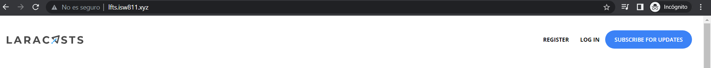
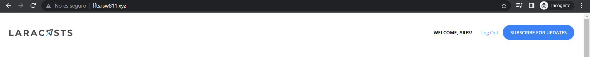
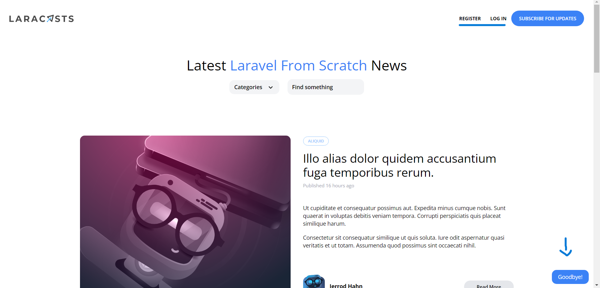

[< Volver al índice](/docs/readme.md)

# Login and Logout

Vamos a simular un inicio de sesión por medio del registro y hacer su correspondiente cierre de sesión. Para esto vamos a `app/Http/Controllers/RegisterController.php` a colocar la siguiente linea al crear el usuario, decimos que este esta logueado. 

```php
    auth()->login(User::create($attributes));
```

Y es que existen diferentes middlewares que son una pieza lógica que solo va a correr cuando una nueva solicitud llega a él. En este caso veremos dos, *guest* hace que si el usuario está logueado, no pueden visitar la pagina entonces los redireciona a la pagina principal, *auth*, hace lo contrario, si el usuario no está logueado, no puede entrar a la pagina. Los middlewares tienen por defecto que los *providers* en `app/Providers/RouteServiceProvider.php` redireccionen a *home* pero nuestro *home* es la raíz, por tanto, lo cambiamos.  

```php
    public const HOME = '/';
```

Además, en `resources/views/components/layout.blade.php` verificamos si el usuario esta logueado, si es el caso entonces le damos un mensaje de bienvenido con su correspondiente nombre y también se le aparece un link para desloguearse y redireccionarlo a la pagina principal. Si este, no esta logueado, entonces se le aparecen los links de las paginas de registro y login. 

```php
    <div class="mt-8 md:mt-0 flex items-center">
        @auth
            <span class="text-xs font-bold uppercase"> Welcome, {{ auth()->user()->name }}!</span>

            <form
                method="POST"
                action="/logout"
                class="text-xs font-semibold text-blue-500 ml-6"
            >
                @csrf

                <button type="submit">Log Out</button>
            </form>
        @else
            <a href="/register" class="text-xs font-bold uppercase">Register</a>
            <a href="/login" class="ml-6 text-xs font-bold uppercase">Log In</a>
        @endauth
        <a href="#" class="bg-blue-500 ml-3 rounded-full text-xs font-semibold text-white uppercase py-3 px-5">
            Subscribe for Updates
        </a>
    </div>
```
- Usuario NO logueado: 
    
- Usuario logueado: 
    

Creamos un controlador con el siguiente comando en nuestra maquina virtual para poder colocar el código del logout. Esto creará un archivo en `app/Http/Controllers/SessionsController.php`.

```bash
    php artisan make:controller SessionsController
```

Nuestras rutas cambian y verifican en *register* solo entran aquellos que no están logueados y creamos una ruta para el logout con un middleware que solo permite que lo vean o lo accionen aquellos que están logueados.  

```php
    use App\Http\Controllers\SessionsController;

    Route::get('register', [RegisterController::class, 'create'])->middleware('guest');
    Route::post('register', [RegisterController::class, 'store'])->middleware('guest');
    Route::post('logout', [SessionsController::class, 'destroy'])->middleware('auth');
```

En *SessionsController* ingresamos la siguiente función que chequea si el usuario está logueado, entonces lo saca de la sesión, le manda un mensaje, lo redirecciona en la pagina principal, lo que provoca es pueda ver los links de *registro* y *login* como condiciones de la vista *layout.blade.php*.

```php
    public function destroy()
    {
        auth()->logout();
        return redirect('/')->with('success', 'Goodbye!');
    }
```

