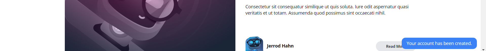

[< Volver al índice](/docs/readme.md)

# Show a Success Flash Message

Todavía no estamos proporcionando al usuario ningún comentario después de que se registre en nuestro sitio. Para esto vamos a crear un mensaje flash en el controlador en nuestra función *store* redireccionamos la pagina y ademas mandamos el mensaje de éxito en `app/Http/Controllers/RegisterController.php`. 

```php
    return redirect('/')->with('success', 'Your account has been created.');
```

Luego crearemos un componente llamado *flash.blade.php* en `resources/views/components` en el cual si se retorna *success* del controlador mostraremos el mensaje, el cual tiene un tiempo especifico en pantalla. 

```php
    @if (session()->has('success'))
        <div x-data="{ show: true }"
            x-init="setTimeout(() => show = false, 4000)"
            x-show="show"
            class="fixed bg-blue-500 text-white py-2 px-4 rounded-xl bottom-3 right-3 text-sm"
        >
            <p>{{ session('success') }}</p>
        </div>
    @endif
```

Este componente lo llamamos al fin del código de `resources/views/components/layout.blade.php` 

```php
    <x-flash />
```


