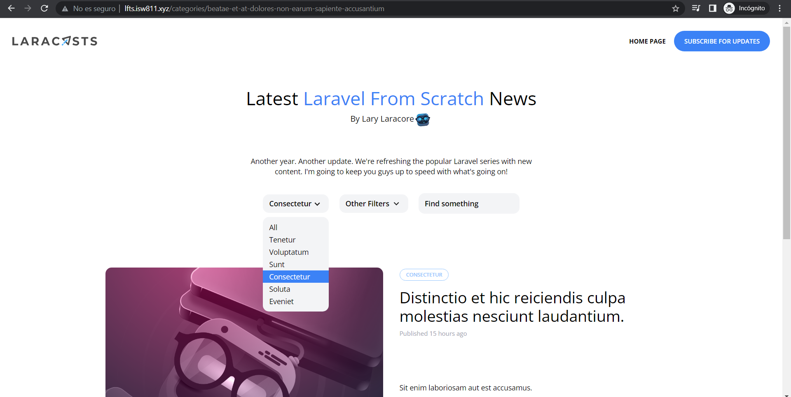

[< Volver al índice](/docs/readme.md)

# How to Extract a Dropdown Blade Component

Ahora hemos creado con éxito la funcionalidad básica para un menú desplegable, pero aún no es reutilizable. Para remediar esto, extraeremos un componente Blade x-dropdown. Esto tendrá el efecto secundario de aislar todo el código específico de Alpine en ese único archivo de componente.

Nuestra sección categoría en la vista del directorio *resources/views/_post-header.blade.php*
```html
    <!--  Category -->
    <div class="relative lg:inline-flex bg-gray-100 rounded-xl">

        <x-dropdown>
            <x-slot name="trigger">
                <button
                    class="py-2 pl-3 pr-9 text-sm font-semibold w-full lg:w-32 text-left flex lg:inline-flex"
                >
                    {{ isset($currentCategory) ? ucwords($currentCategory->name) :
                    'Categories' }}
                    <x-icon
                        name="down-arrow"
                        class="absolute pointer-events-none"
                        style="right: 12px;"
                    />
                    <x-icon name="down-arrow" class="absolute pointer-events-none" style="right: 12px;"/>
                </button>
            </x-slot>

            <x-dropdown-item href="/" :active="request()->routeIs('home')"
                >All</x-dropdown-item
            >

            @foreach ($categories as $category)
            <x-dropdown-item
                href="/categories/{{ $category->slug }}"
                :active='request()->is("categories/{$category->slug}")'
                >{{ ucwords($category->name) }}
            </x-dropdown-item>
            @endforeach
        </x-dropdown>
    </div>
```
Los componentes que llamamos en *_post-header.blade.php* son los siguientes: 

- **drop-item.blade.php** y  la crearemos en *resources/views/components* este mantiene seleccionadas la categoría en el menú desplegable que coincida con la URL. 
    ```php
    @props(['active' => false])
    @php
        $classes = 'block text-left px-3 text-sm leading-6 hover:bg-blue-500 focus:bg-blue-500 hover:text-white focus:text-white';
        if ($active) $classes .= ' bg-blue-500 text-white';
    @endphp

    <a {{ $attributes(['class' => $classes]) }}
    >{{ $slot }}</a>
    ```

- **dropdown.blade.php** la crearemos en *resources/views/components* es el que desplegable el menú desplegable al ser clicleado. 
    ```php
    @props(['trigger'])
    <div x-data="{ show: false }" @click.away="show = false">
        <div @click="show = ! show">{{ $trigger }}</div>
        <div
            x-show="show"
            class="py-2 absolute bg-gray-100 mt-2 rounded-xl w-full z-50"
            style="display: none"
        >
            {{ $slot }}
        </div>
    </div>
    ```

- **icon.blade.php** la crearemos en *resources/views/components* crea una flecha hacia abajo en representación del menú desplegable.
    ```php
    @props(['name'])
    @if ($name === 'down-arrow')
        <svg {{ $attributes(['class' => 'transform -rotate-90']) }} width="22" height="22" viewBox="0 0 22 22">
            <g fill="none" fill-rule="evenodd">
                <path stroke="#000" stroke-opacity=".012" stroke-width=".5" d="M21 1v20.16H.84V1z">
                </path>
                <path fill="#222"
                    d="M13.854 7.224l-3.847 3.856 3.847 3.856-1.184 1.184-5.04-5.04 5.04-5.04z"></path>
            </g>
        </svg>
    @endif
    ```

Por ultimo, le podemos poner un nombre a los endpoints, en este caso a la raíz le pondremos *home para que al estar en la pagina de inicio se vea seleccionada en el menú desplegable, esto se hace al llamar el dropdown-item en *_post-header.blade.php*. La ruta la se encuentra en: *routes/web.php*.
```php
Route::get('/', function () {
    return view('posts', [
        'posts'=> Post::latest()->with(['category', 'author'])->get(),
        'categories' => Category::all()
    ]);
})->name('home');
```



