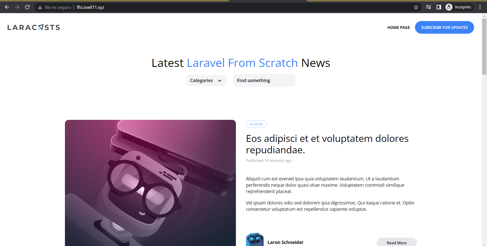

[< Volver al índice](/docs/readme.md)

# Quick Tweaks and Clean-Up

Estamos a punto de pasar a la función de búsqueda, pero antes se harán unos cambios en el diseño de la aplicación. 

1. **_post-header.blade.php** : Vamos a comentar la sección "others filters" de *resources/views* para que solo quede el menú desplegable y el input de búsqueda, además quitamos texto innecesario en el *header*.

    ```html
        <header class="max-w-xl mx-auto mt-20 text-center">
            <h1 class="text-4xl">
                Latest <span class="text-blue-500">Laravel From Scratch</span> News
            </h1>

            <div class="space-y-2 lg:space-y-0 lg:space-x-4 mt-4">
                <!--  Category -->
                <div class="relative lg:inline-flex bg-gray-100 rounded-xl">

                    <x-dropdown>
                        <x-slot name="trigger">
                            <button
                                class="py-2 pl-3 pr-9 text-sm font-semibold w-full lg:w-32 text-left flex lg:inline-flex"
                            >
                                {{ isset($currentCategory) ? ucwords($currentCategory->name) :
                                'Categories' }}
                                <x-icon
                                    name="down-arrow"
                                    class="absolute pointer-events-none"
                                    style="right: 12px;"
                                />
                                <x-icon name="down-arrow" class="absolute pointer-events-none" style="right: 12px;"/>
                            </button>
                        </x-slot>

                        <x-dropdown-item href="/" :active="request()->routeIs('home')"
                            >All</x-dropdown-item
                        >

                        @foreach ($categories as $category)
                        <x-dropdown-item
                            href="/categories/{{ $category->slug }}"
                            :active='request()->is("categories/{$category->slug}")'
                            >{{ ucwords($category->name) }}
                        </x-dropdown-item>
                        @endforeach
                    </x-dropdown>
                </div>

                
                <!-- Other Filters -->
                <!-- <div
                    class="relative flex lg:inline-flex items-center bg-gray-100 rounded-xl"
                >
                    <select
                        class="flex-1 appearance-none bg-transparent py-2 pl-3 pr-9 text-sm font-semibold"
                    >
                        <option value="category" disabled selected>
                            Other Filters
                        </option>
                        <option value="foo">Foo</option>
                        <option value="bar">Bar</option>
                    </select>

                    <svg
                        class="transform -rotate-90 absolute pointer-events-none"
                        style="right: 12px;"
                        width="22"
                        height="22"
                        viewBox="0 0 22 22"
                    >
                        <g fill="none" fill-rule="evenodd">
                            <path
                                stroke="#000"
                                stroke-opacity=".012"
                                stroke-width=".5"
                                d="M21 1v20.16H.84V1z"
                            ></path>
                            <path
                                fill="#222"
                                d="M13.854 7.224l-3.847 3.856 3.847 3.856-1.184 1.184-5.04-5.04 5.04-5.04z"
                            ></path>
                        </g>
                    </svg>
                </div> -->

                <!-- Search -->
                <div
                    class="relative flex lg:inline-flex items-center bg-gray-100 rounded-xl px-3 py-2"
                >
                    <form method="GET" action="#">
                        <input
                            type="text"
                            name="search"
                            placeholder="Find something"
                            class="bg-transparent placeholder-black font-semibold text-sm"
                        />
                    </form>
                </div>
            </div>
        </header>
    ```
2. **dropdown.blade.php**: En el menú desplegable solo se se mostrarán un máximo de 52 elementos en el directorio *resources/views/components*
    ```php
        @props(['trigger'])
        <div x-data="{ show: false }" @click.away="show = false">
            <div @click="show = ! show">{{ $trigger }}</div>
            <div
                x-show="show"
                class="py-2 absolute bg-gray-100 mt-2 rounded-xl w-full z-50 overflow-auto max-h-52"
                style="display: none"
            >
                {{ $slot }}
            </div>
        </div>
    ```
3.  **PostFactory.php**: Haremos que los excerpt y el body de los posts sean genéricos e incluyan etiquetas HTML en el directorio *database/factories*. 
    ```php
        public function definition()
        {
            return [
                'user_id' => User::factory(),
                'category_id' => Category::factory(),
                'title' => $this->faker->sentence,
                'slug' => $this->faker->slug,
                'excerpt' => '<p>' . implode('</p><p>', $this->faker->paragraphs(2)) . '</p>',
                'body' => '<p>' . implode('</p><p>', $this->faker->paragraphs(2)) . '</p>',
            ];
        }
    ```
4. **IMPORTANTE:** Cuando se agregue el excerpt o el body a código para que no se visualice en web se tiene encerrar en paréntesis y signos de exclamación, sin agregar las mismas etiquetas HTML que ya contienen por defecto. 

    ```php
        {!! $post->excerpt !!}
    ```

