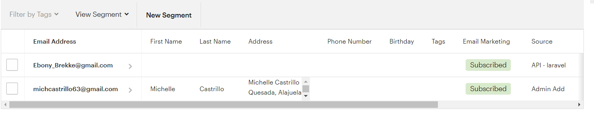

[< Volver al índice](/docs/readme.md)

# Mailchimp API Tinkering

Empecemos por familiarizarnos con la API de Mailchimp. Luego revisaremos los conceptos básicos sobre cómo realizar algunas llamadas API iniciales.

Primeramente, nos vamos a crear una cuenta en [Mailchimp](https://mailchimp.com/), el cual, es una plataforma de automatización de marketing que te ayuda a compartir campañas de correo electrónico.

Al crear nuestra cuenta, el siguiente paso es crear nuestra clave API en Cuenta y billing->Extras->Claves API->Crear clave, al tenerla lista vamos a configurar nuestro `.env` y agregamos nuestra clave; en nuestro caso: 

```bash
    MAILCHIMP_KEY= 5388e6f26b16fa48e7d1ea1c690d63ce-us12
```
Después descargamos las dependencias necesarias en nuestro proyecto de Mailchimp con el siguiente comando: 

```bash
    composer require mailchimp/marketing
```

Agregamos nuestra clave API al directorio `config/services.php` con el siguiente código: 

```php
    'mailchimp' => [
        'key' => env('MAILCHIMP_KEY'),
        'lists' => [
            'subscribers' => env('MAILCHIMP_LIST_SUBSCRIBERS')
        ]
    ]
```

Por ultimo agregamos nuestra ruta en `routes/web.php`, en el cual agregamos el servidor de nuestra API la cual son los últimos dígitos de nuestra clave API, nuestro id de mailchimp, y algunos datos predeterminados para la suscripción de un usuario. 

```php
    Route::get('ping', function() {
        $mailchimp = new \MailchimpMarketing\ApiClient();

        $mailchimp->setConfig([
            'apiKey' => config('services.mailchimp.key'),
            'server' => 'us12'
        ]);

            $response = $mailchimp->lists->addListMember('6f0c5f1e34', [
                'email_address'=> "Ebony_Brekke@gmail.com",
                'status'=>"subscribed"
            ]);

            ddd($response);


    });
```

Para verificar que funcionó correctamente, ingresamos a la ruta /ping nos tiene que retornar un json, mas, para estar seguros, lo verificamos directamente desde MailChimp, el cual si se accede a Cuenta y billing->Audiencia->Todos los contactos se podrá ver como nuestro usuario se ha subscrito. 

