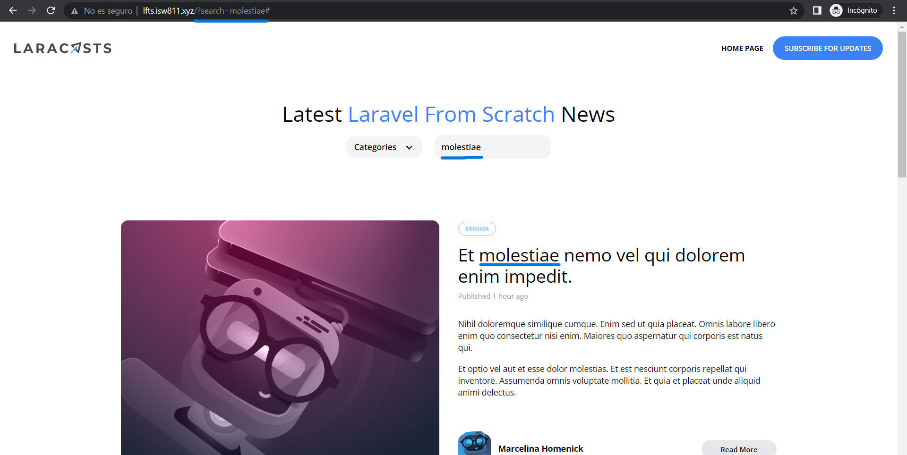

[< Volver al índice](/docs/readme.md)

# Search (The Messy Way)

En esta nueva sección, implementaremos la funcionalidad del input de búsqueda para nuestro página web. 

El código de este input tiene un método *get* por tanto podemos mandarle lo que usuario ingresa por medio de la URL. Para esto debemos cambiar nuestra ruta en *routes.web.php* en el cual verificamos si hay una solicitud por medio de este input verificamos lo digitado con los títulos o el body de nuestros posts, si coinciden se retornan solo los que contengan la palabra. 

```php
    Route::get('/', function () {
        $posts = Post::latest();
        
        if(request('search')){
            $posts->where('title', 'like', '%' . request('search') . '%')
            ->orWhere('body', 'like', '%' . request('search') . '%');
        }

        return view('posts', [
            'posts'=> $posts->get(),
            'categories' => Category::all()
        ]);
    })->name('home');
```
Nos aseguramos que nombre del input sea el mismo que verificamos en la ruta por esto cambios solo la sección de "Search" en *resources/views/_posts-header.blade.php*. Además le damos un valor igual a la búsqueda que el usuario digitó para que permanezca activo y el usuario pueda pueda ver que fue lo que buscó.
```html
    <!-- Search -->
    <div
        class="relative flex lg:inline-flex items-center bg-gray-100 rounded-xl px-3 py-2"
        >
        <form method="GET" action="#">
            <input
                type="text"
                name="search"
                placeholder="Find something"
                class="bg-transparent placeholder-black font-semibold text-sm"
                value= "{{ request('search') }}"
            />
        </form>
    </div>
```

