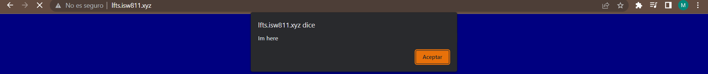

# Curso de Laravel from Scratch

## Módulo 2 - Episodio 5 - How a Route Loads a View
A continuación se muestra como se manejan las rutas asociadas a una URL en Laravel: 
 ```php
   Route::get('/', function () {
    return view('welcome');
});
```
Si una ruta que no esta especificada o un se escribe un endpoint incorrecto se da un error 404, lo que significa que el enlace no esta habilitado. 

Es importante mencionar que las rutas pueden retornar un json, una vista HTML, un texto, entre otros. En este caso, nuestro endpoint es /example. 
 ```php
   Route::get('/example', function () {
    return [['id'=>' 0 ','name' =>'ashley'],['id'=>' 1','name' =>'michelle']]; 

});
```


## Módulo 2 - Episodio 6 - Include CSS and Javascript

En este episodio se muestra como incluir js(funcionalidad) y css (estilos) al HTML.
 ```php
<!DOCTYPE html>
<title>My blog</title>
<link rel="stylesheet" href="/app.css">
<script src="/app.js"></script>
<body>
    <h1>Hello world</h1>
</body>
```
Se creó un archivo app.css en la carpeta public, dandole estilo al cuerpo del html. , Es importante destacar que todos los archivos tipo css o js van en la carpeta public para un mejor enrutamiento de Laravel. 
 ```css
body{
    background: navy;
    color: white;
}
```


Se creó un archivo app.js en la carpeta public para darle una pequeña funcionalidad a la página, en este caso una ventana emergente.  
```js
alert('Im here');
```

## Módulo 2 - Episodio 7 - Make a Route and Link to it
En este episodio se muestra como enlazar una vista a otra por medio de un link. Para esto un blog básico no dinámico con dos vistas en las cuales posts contendrá todos los artículos y post solo la información de una articulo: 

\
Y sus respectivas rutas: 
 ```php
Route::get('/posts', function () {
    return view('posts');

});

Route::get('/post', function () {
    return view('post'); 
});
``` 

No solo podemos acceder a las vistas por medio de la URL sino también por medio del HTML, en este caso, por medio de un link accedemos a la vista post
```php
<h1><a href="/post">My first blog</a></h1>
``` 

    * Vista principal posts

    * Vista de un articulo post


## Módulo 2 - Episodio 8 - Store Blog Posts as HTML Files
En este capitulo se realizara el blog dinámico, para esto pondremos un redireccionamiento a cada contenido post.  
```php
<?=$post;?>
``` 
Además se agregara una carpeta posts la cual tendrá tres archivos, estos tendrán cada  contenido post por aparte. 

\
Para el direccionamiento en las rutas siempre se tendrá un pagina principal posts, y luego un endpoint que pueda recibir cualquier ruta además de la principal: 'posts/{post}'. Se redirecciona a la carpeta donde están los post de manera individual. Ponemos una condición por si se coloca una URL que no tengamos, y se redirecciona a la pagina principal para evitar errores, al final se obtiene cada contenido de los post. 
```php
Route::get('/posts', function () {
    return view('posts'); 
});
Route::get('posts/{post}', function ($slug) {
    $path = __DIR__ . "/../resources/posts/{$slug}.html";

    if(! file_exists($path)){
        return redirect("/posts");
    }

    $post = file_get_contents($path);

    return view('post', [
        'post' => $post
    ]);
});
``` 
Cambiamos cada link por cada titulo en el cual almacenamos los post: 
```php
 <h1><a href="/posts/my-third-post">My third post</a></h1>
``` 
## Módulo 2 - Episodio 9 - Route Wildcard Constraints
La siguiente linea nos asegura que al ingresar nuestra URL puede estar en mayúscula, miniscule, o cualquier caracter. 
```php

Route::get('posts/{post}', function ($slug) {
    
})->Where('post', '[A-z_\-]+');
``` 
## Módulo 2 - Episodio 10 - Use Coaching for Expensive Operations
Al verificar si el archivo o la ruta existe, se le devuelve la vista, pero se esta ingresando al sistema de archivo cada vez que se accede a un post, lo que lo hace una pagina no tan renderizada, por esto es mejor almacenarla en el caché el tiempo que creamos conveniente, así el sistema evita leer el archivo cada vez que el usuario accede a un post, haciendo la pagina mas eficiente. 
```php

Route::get('posts/{post}', function ($slug) {

    if(! file_exists($path =  __DIR__ . "/../resources/posts/{$slug}.html")){
        return redirect("/posts");
    }

    $post = cache()->remember("posts.($slug)", 1200, fn() => file_get_contents($path));

    return view('post', ['post' => $post]);
    
})->Where('post', '[A-z_\-]+');
``` 
## Módulo 2 - Episodio 11 - Use the Filesystem Class to Read a Directory
Ahora averigüemos cómo obtener y leer todas las publicaciones dentro del directorio de recursos/publicaciones. Una vez que tenemos una matriz adecuada, podemos recorrerlos y mostrar cada uno en la página principal de descripción general del blog.
Primero crearemos un modelo en el directorio App

\
El cual tendrá estas dos funciones las cuales all(), nos permitirá acceder a cualquier post desde cualquier parte. Y find() encontrará cada post que cramos en el directorio de resources de manera singular. 
```php
  public static function all()
    {
        $files = File::files(resource_path("posts/"));
        
        return array_map(fn($file) => $file->getContents(), $files);
    }

    public static function find($slug)
    {
        if(!file_exists($path =  resource_path("posts/{$slug}.html"))){
           throw new  ModelNotFoundException();
        }

        $post = cache()->remember("posts.($slug)", 1200, fn() => file_get_contents($path));

        return view('post', ['post' => $post]);

    }
``` 
En la vista posts pondremos un foreach el cual nos traera cada post, en vez de los links. 
```html
<body>
    <?php foreach ($posts as $post) : ?>
    <article>
        <?= $post; ?>
    </article>
    <?php endforeach; ?>
</body>
``` 
Estas serán nuestras dos unicas rutas, una para nuestra pagina principal el cual traera y la otra para visualizar solo el contenido de cada post. Importante recordar que debemos exportar el modelo de Post. 
```php

use App\Models\Post;


Route::get('/', function () {
    return view('posts', [
        'posts'=> Post::all()
    ]);
});

Route::get('posts/{post}', function ($slug) {

    $post = Post::find($slug);

    return view('post', [
        'post'=> $post
    ]);

})->Where('post', '[A-z_\-]+');
``` 
## Módulo 2 - Episodio 12 - Find a Composer Package for Post Metadata
En este episodio se trabajan metadatos llamados Yaml Front Matter, con ayuda del composer. Se descarga los metadatos en nuestra maquina virtual de la siguiente manera: 

```bash
cd /vagrant/sites/lfts.isw811.xyz
composer require spatie/yaml-front-matter
```
Agregamos el siguiente encabezado a nuestros post individuales, este será el contenido de nuestros post, y será mas fácil acceder a ellos gracias a los metadatos. 
```bash
---
title: My first post
slug: my-first-post
excerpt:  Lorem ipsum dolor sit amet consectetur adipisicing elit.
date: 2023-06-20
---
```
En el modelo que habíamos creado del directorio App, llamamos la librería para poder usar los metadatos, y se crea un objeto con su respetivo constructor. 
```php
use Spatie\YamlFrontMatter\YamlFrontMatter;

class Post {

    public $title;
    public $excerpt;
    public $date;
    public $body;
    public $slug;

    public function __construct($title, $excerpt, $date, $body, $slug) {
        $this->title = $title;
        $this->excerpt = $excerpt;
        $this->date = $date;
        $this->body = $body;
        $this->slug = $slug;
    }
}
```
Agregamos dos funciones más al modelo, donde se extrae la información de cada post para retornarlo a la vista, la ultima función buscar que el slug coincida con el parámetro 
```php
    public static function all()
    {
        return collect(File::files(resource_path("posts")))
        ->map(fn($file)=> YamlFrontMatter::parseFile($file))
        ->map(fn ($document) => new Post(
                $document->title,
                $document->excerpt,
                $document->date,
                $document->body(),
                $document->slug,
        ));
    }

    public static function find($slug)
    {
        return static::all()->firstWhere('slug',$slug);

    }
```
Cambiamos la vista posts por un foreach que nos devuelva todos los posts, y además un link que nos ayude a acceder a su contenido. 
```html
<!DOCTYPE html>
<title>My blog</title>
<link rel="stylesheet" href="/app.css">
<body>
    <?php foreach ($posts as $post) : ?>
    <article>
       <h1><a href="/posts/<?= $post->slug; ?>"><?= $post->title; ?></a></h1>
       <div>
            <?= $post->body; ?>
        </div>
    </article>
    <?php endforeach; ?>
</body>
```
En el contenido del post podemos agregar las variables que quisieramos mostrar en el blog.  
```html
<h1><?= $post->title; ?></h1>
<div>
    <?= $post->excerpt; ?>
</div>
```
Las rutas que vamos a necesitar son las que muestran todos los post, y la ultima es la que encuentra el slug, para buscar su respectiva vista.
```php
Route::get('/', function () {
    return view('posts', [
        'posts'=> Post::all()
    ]);
});

Route::get('posts/{post}', function ($slug) {

    return view('post', [
        'post'=> Post::find($slug)
    ]);

})->Where('post', '[A-z_\-]+');
```
Y así obtenemos una página dinámica


## Módulo 2 - Episodio 13 - Colletion Sorting and Caching Refresher
Cada publicación ahora incluye la fecha de publicación como parte de sus metadatos, sin embargo, el feed actualmente no está ordenado de acuerdo con esa fecha. Afortunadamente, debido a que estamos usando colecciones de Laravel.

Por tanto, debemos agregar el siguiente código al directorio app/Models/Post.php para ordenar los post de manera descendente por la fecha. 
```php
    public static function all()
    {
        return cache()->rememberForever('posts.all', function () {
            return collect(File::files(resource_path("posts")))
                ->map(fn($file)=> YamlFrontMatter::parseFile($file))
                ->map(fn ($document) => new Post(
                        $document->title,
                        $document->excerpt,
                        $document->date,
                        $document->body(),
                        $document->slug,
                ))
                ->sortByDesc('date');
        });
    }
```
## Módulo 3 - Episodio 14 - Blade The Absolute Basics
Blade es el motor de plantillas de Laravel para las vistas. Es como una capa sobre PHP para hacer que la sintaxis requerida sea más limpia y concisa. 
Archivo blade.php
```php
@if
    //sintaxis
@endif
```
Archivo .php 
```php
   <?php
        if () {
            //sintaxis
        }
    ?>
```